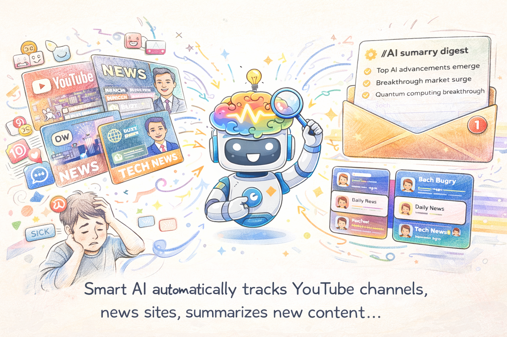

# NewsPulseAI



**NewsPulseAI** is an AI-powered YouTube digest platform that monitors your favourite YouTube channels and delivers beautifully designed email summaries straight to your inbox every morning at 6 AM — fully automated, zero manual effort.

🌐 **Live:** https://newspulseai-alpha.vercel.app

---

## How It Works

```
User adds a YouTube channel
  → Inngest cron fires at 6:00 AM UTC daily
  → YouTube Data API v3 fetches videos published in the last 25 hours
  → Google Gemini AI watches each video and writes a 3–4 sentence summary
  → Resend delivers a React Email digest to the user's inbox
  → Neon PostgreSQL records channels, videos, summaries, and users
```

No polling, no manual triggers. The entire pipeline runs automatically in the cloud every morning.

---

## Tech Stack

### Frontend
| Tool | Purpose |
|------|---------|
| **Next.js 16** | React framework (App Router, server components, API routes) |
| **Tailwind CSS v4** | Utility-first styling via `@import "tailwindcss"` — no config file |
| **Framer Motion** | Scroll-driven animations, entrance effects, modal transitions |
| **Space Grotesk + Bebas Neue** | Brand typography via `next/font/google` |

### Backend & API
| Tool | Purpose |
|------|---------|
| **Next.js API Routes** | REST endpoints for channels (GET / POST / DELETE) |
| **Clerk** | Authentication — sign-up, sign-in, session management |
| **Drizzle ORM** | Type-safe SQL query builder with schema-first migrations |
| **Neon** | Serverless PostgreSQL — stores users, channels, videos, summaries |

### Automation Pipeline
| Tool | Purpose |
|------|---------|
| **Inngest** | Durable cron job scheduler — fires `dailyDigest` at `0 6 * * *` UTC, retries on failure, full run history |
| **YouTube Data API v3** | Fetches new videos from subscribed channels published in the last 25 hours |
| **Google Gemini Flash** | Multimodal AI — watches YouTube videos directly (no transcript needed) and writes news-style summaries, batched up to 10 per request |
| **Resend** | Transactional email delivery |
| **React Email** | Renders the digest as a responsive HTML email component |

### Infrastructure
| Tool | Purpose |
|------|---------|
| **Vercel** | Hosting, edge deployment, automatic CI/CD on every push |
| **Neon** | Serverless Postgres with branching and connection pooling |

---

## Database Schema

```
users       — clerk_id (PK), email, name
channels    — id, clerk_id (FK → users), youtube_channel_id, channel_name
videos      — id, channel_id (FK → channels), youtube_video_id (UNIQUE), title, description, summary, published_at
```

Cascade deletes: removing a user removes their channels; removing a channel removes its videos.

---

## Automated Digest Flow (Deep Dive)

1. **Inngest cron** triggers `dailyDigest` at 6:00 AM UTC via a webhook call to `/api/inngest` on the live Vercel deployment
2. **Fetch users** — all registered users are loaded from Neon
3. **Per user:** fetch their channels → call YouTube Data API for videos published in the last 25 hours
4. **Dedup** — new videos are inserted with `onConflictDoNothing` on `youtube_video_id` so no video is summarised twice
5. **Gemini batch summarisation** — up to 10 YouTube video URLs are sent to Gemini Flash in a single request; Gemini watches the videos and returns a JSON array of summaries
6. **Summaries persisted** to Neon for future reference
7. **Resend** delivers the `DigestEmail` React component as a styled HTML email with a card per video

---

## Local Development

```bash
# Install dependencies
npm install

# Start dev server
npm run dev

# Database
npx drizzle-kit generate   # generate migration from schema changes
npx drizzle-kit migrate    # apply migrations to Neon
npx drizzle-kit studio     # visual DB browser

# Type checking & lint
npx tsc --noEmit
npx eslint .
```

Start the Inngest Dev Server alongside `npm run dev` to test functions locally and trigger them manually from the Inngest UI at `http://localhost:8288`.

---

## Environment Variables

```bash
DATABASE_URL=                        # Neon pooled connection string
NEXT_PUBLIC_CLERK_PUBLISHABLE_KEY=
CLERK_SECRET_KEY=
NEXT_PUBLIC_CLERK_SIGN_IN_URL=/sign-in
NEXT_PUBLIC_CLERK_SIGN_UP_URL=/sign-up
NEXT_PUBLIC_CLERK_AFTER_SIGN_IN_URL=/channels
NEXT_PUBLIC_CLERK_AFTER_SIGN_UP_URL=/channels
GEMINI_API_KEY=                      # Google AI Studio
YOUTUBE_API_KEY=                     # Google Cloud — YouTube Data API v3
RESEND_API_KEY=
RESEND_FROM_EMAIL=                   # e.g. digest@yourdomain.com
INNGEST_EVENT_KEY=                   # Inngest Cloud
INNGEST_SIGNING_KEY=                 # Inngest Cloud
NEXT_PUBLIC_APP_URL=                 # e.g. https://newspulseai-alpha.vercel.app
# INNGEST_DEV=1                      # Local dev only — do NOT set in Vercel
```
